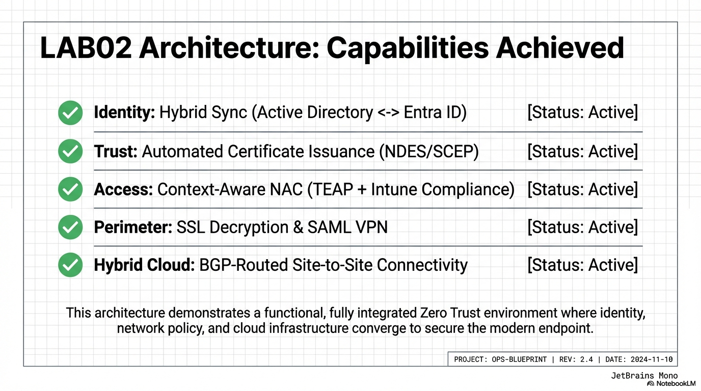

# Hybrid Zero Trust Architecture: Engineering Portfolio

## Overview
This repository documents the engineering and governance of a multi-vendor hybrid environment. The project serves as a functional staging area to bridge on-premises virtualization with Microsoft Azure, creating a unified security fabric centered on identity-based policy enforcement and automated trust delivery.

*Figure 1: Full-stack integration summary across Identity, Trust, Access, Perimeter, and Hybrid Cloud.*

---

## Core Engineering Pillars

### Hybrid Routing and Connectivity
* [Border Gateway Protocol (BGP)](./Security/edge-security-perimeter/): Dynamic routing implementation between on-premises Edge and Azure Virtual WAN for resilient path selection.
* [Site-to-Site Fabric](./Security/edge-security-perimeter/): Deployment of redundant IPsec tunnels utilizing IKEv2 and BGP prefix advertisements.

### Unified Identity and Trust
* [Hybrid Identity](./Security/identity-governance/): Synchronization of on-premises Active Directory with Microsoft Entra ID.
* [Multi-Tier PKI](./Security/identity-governance/): Implementation of a standalone Root-CA and Intermediate-CA for secure certificate lifecycle management.

### Access Control and Security
* [Zero Trust Access](./Solutions_Architecture/Integration/): Integration of Aruba ClearPass and Microsoft Intune for context-aware network admission.
* [Edge Governance](./Security/edge-security-perimeter/): Palo Alto NGFW deployment featuring SSL Forward Proxy and App-ID security policies.

---

## Portfolio Navigation

| Category | Deep-Dive Links |
| :--- | :--- |
| **Integrated Environment** | [Complete Lab Integration Build](./Solutions_Architecture/Integration/) |
| **Security Engineering** | [Identity Governance](./Security/identity-governance/) \| [Edge Security](./Security/edge-security-perimeter/) |
| **Architecture Playbook** | [Solutions Architecture](./Solutions_Architecture/) |
| **Technical Assets** | [Image Resources](./resources/images/) \| [Architectural Slides](./resources/slides/) |

---

## Technical Standards and Validation
Functional success is proven through operational evidence:
* Traffic Observability: Real-time logs from Palo Alto and ClearPass telemetry.
* Compliance Reporting: Live status dashboards from Microsoft Intune and Azure Backup status.
* Engineering Documentation: Repeatable deployment templates for hybrid infrastructure.

---
Engineering Portfolio | Focused on Resilient Security Architectures
