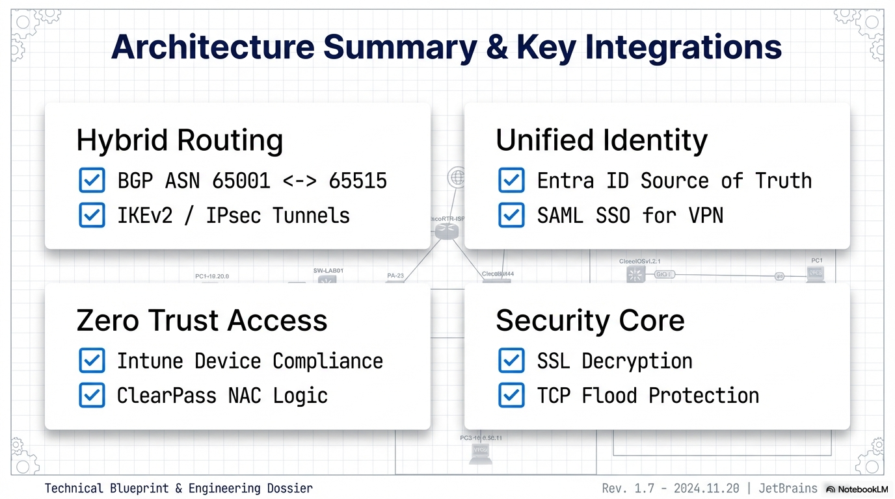

# Solutions Architecture: Hybrid Zero Trust Environment

## Purpose
This section documents the architectural design and composition of the hybrid Zero Trust environment. It focuses on how identity, trust, networking, and security components are assembled into a coherent system, and why specific architectural decisions were made.

**Project Status:** This is an active engineering build. Architectural designs and content are updated as new modules are validated and integrated.

---

## Architectural Scope
The solution architecture spans four primary domains:
* Identity and Trust Plane
* Access and Enforcement Plane
* Connectivity and Routing Plane
* Infrastructure and Hosting Plane

Each domain is designed independently but operates as part of a unified Zero Trust fabric.

---

## High-Level Architecture Context

*Figure 1: High-level solution architecture showing identity-driven trust, access enforcement, and hybrid connectivity.*

This view is intentionally conceptual. It establishes architectural context rather than operational detail. Logical, physical, and trust-flow diagrams are provided within the relevant sub-sections below.

---

## Architecture Domains

### Identity and Trust Plane
Identity is treated as the primary control plane for access decisions.
* Active Directory provides authoritative identity for on-premises services.
* Microsoft Entra ID acts as the cloud identity and policy enforcement layer.
* A multi-tier PKI enables device and service trust through automated certificate lifecycle management.

### Access and Enforcement Plane
Access enforcement is context-aware, not network-location-based.
* Network access is granted only after successful identity and posture validation.
* Aruba ClearPass enforces NAC decisions using RADIUS and 802.1X.
* Microsoft Intune provides device compliance signals.

### Connectivity and Routing Plane
Hybrid connectivity is designed to behave like an enterprise WAN.
* Site-to-site IPsec connectivity using IKEv2.
* Dynamic route exchange using BGP (Border Gateway Protocol).
* Clear separation between control plane and data plane traffic.

### Security and Segmentation Plane
Security enforcement is centralized and policy-driven.
* Palo Alto NGFW provides App-ID–based policy enforcement.
* SSL decryption is applied selectively based on trust and risk.
* Explicit segmentation between user, server, DMZ, and cloud zones.

---

## Design Principles
* Identity first: Network location does not imply trust.
* Least privilege by default: Access is explicitly granted, not implied.
* Separation of concerns: Identity, access, routing, and enforcement are distinct layers.
* Operational realism: Designs reflect enterprise constraints and failure modes.

---

## Solutions Navigation

| Section | Focus |
| :--- | :--- |
| [Integration-Security-and-Operations](./Integration-Security-and-Operations/) | Multi-vendor orchestration and operational visibility. |
| [Migration-Cloud-Modernisation](./Migration-Cloud-Modernisation/) | Strategy for transitioning legacy workloads to hybrid cloud. |
| [PoC and Validation](./PoC%20and%20Validation/) | Engineering tests, routing verification, and protocol analysis. |

---

## Key Outcome
This solution architecture demonstrates how Zero Trust principles are operationalized across a hybrid enterprise environment using real-world technologies and constraints.

---
[Return to Root README](../README.md)
