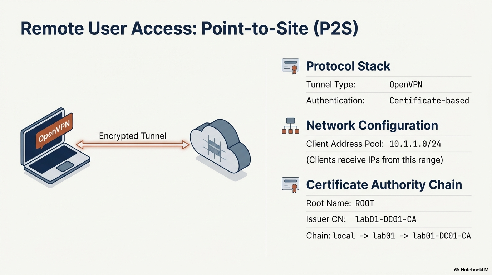

# Azure Hybrid Connectivity: S2S VPN and P2S Client Access

## Executive Summary
This project documents the deployment of a hybrid cloud network infrastructure in the **westeurope** region using Azure Resource Manager (ARM). The primary objective is to establish a secure, dynamic **Site-to-Site (S2S) VPN** connection leveraging **Border Gateway Protocol (BGP)** for automated route exchange.

*Figure 1: High-level overview of the architectural capabilities, including BGP-enabled IPsec, OpenVPN remote access, and secure compute.*

Additionally, the architecture supports **Point-to-Site (P2S)** connectivity, enabling remote clients to connect securely via OpenVPN using certificate-based authentication.

* **Project Presentation**: [Download/View Technical Slide Deck](../../../resources/slidedecks/Azure_Hybrid_Connectivity_and_Trusted_Compute_Deployment.pdf)

---

## Core Network Architecture
The foundation of the deployment is a centralized Hub Virtual Network (VNet) designed to isolate gateway traffic from general workloads.

### Virtual Network (nf-hub)
* **Address Space**: `172.16.0.0/16`
* **Location**: westeurope
* **Subnets**:
    * **default**: `172.16.0.0/24` (Hosts VM workloads)
    * **GatewaySubnet**: `172.16.1.0/27` (Dedicated VPN Gateway capacity)

### Public Endpoint
* **Public IP (nf-gwip)**: `52.166.77.218`
* **SKU**: Standard (Static Allocation)

---

## Site-to-Site (S2S) VPN Connectivity
The S2S tunnel provides a robust IPsec bridge between Azure and the on-premises network.

### BGP Configuration Summary
BGP facilitates dynamic routing, ensuring that cloud and on-premises environments are aware of each other's network changes without manual route updates.

| Parameter | Azure Gateway (ng-vpngw) | On-Premises Gateway (nf-lng) |
| :--- | :--- | :--- |
| **ASN** | 65515 | 65010 |
| **Peering IP** | 172.16.1.30 | 10.0.0.1 |

---

## Point-to-Site (P2S) VPN Configuration
The VPN Gateway is configured to provide secure remote access for individual administrative clients via the OpenVPN protocol.

*Figure 2: Engineering view of the Point-to-Site configuration, including client address pools and certificate-based authentication.*

* **Client Address Pool**: `10.1.1.0/24`
* **Protocol**: OpenVPN
* **Authentication**: Certificate-based (Root Certificate embedded in ARM template)

---

## Virtual Machine Deployment & Security
A Linux workload was provisioned to validate cross-premises connectivity.

### VM Specifications (nf-vm1)
* **OS**: Ubuntu 24.04 LTS (Trusted Launch / Secure Boot enabled)
* **Network**: Accelerated Networking enabled on `nf-vm1555` interface.
* **Security Posture**: Inbound SSH (TCP/22) permitted via NSG.

---

## Governance & Metadata
* **Creator**: Nick Fennell
* **Creation Dates**: July 22–24, 2025
* **Region**: westeurope

---
[Return to Modernisation Overview](../README.md) | [Return to Root](../../../README.md)
