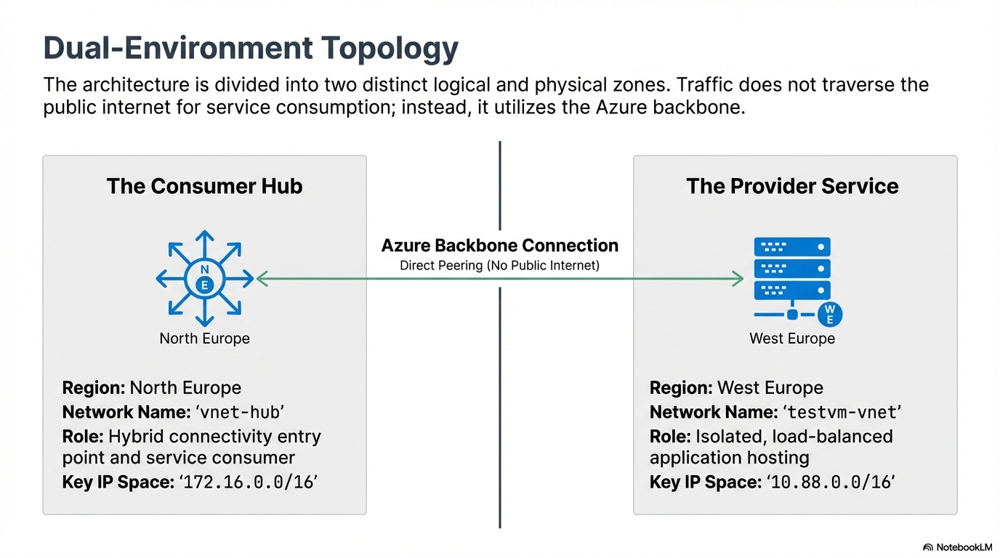
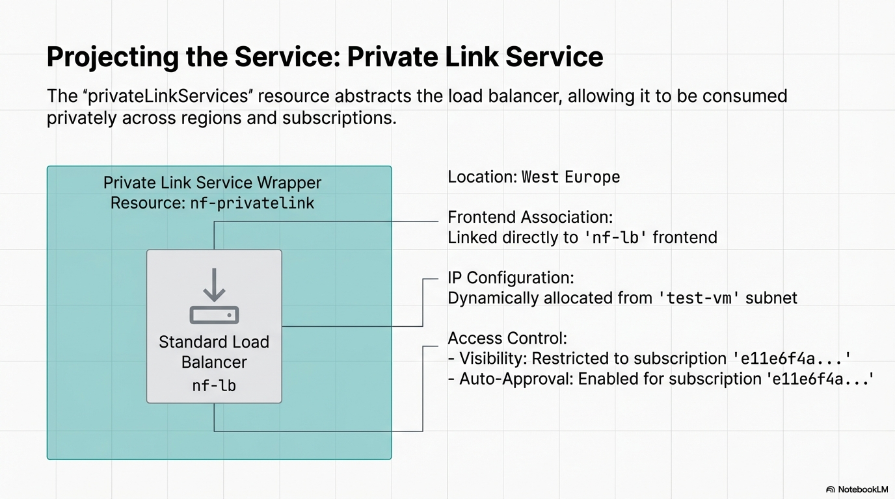

# Azure Hybrid Networking & Private Service Projection  
### Tenant-to-Tenant Private Link — Business-Critical Incident Resolution

---

## Overview

This project documents a **business-critical tenant-to-tenant Azure Private Link incident** affecting a high-value enterprise customer, where **every minute of service disruption resulted in direct financial and operational impact**.

Initial escalation placed responsibility on the **consumer environment** (routing, DNS, firewalls).  
To break the escalation deadlock — including **live troubleshooting calls with Microsoft** — a **production-accurate reference lab** was deployed to isolate fault domains end-to-end.

### Outcome

This lab conclusively demonstrated:

- **DNS was the initial blocker**
- After DNS was resolved, the **final blocker was the supplier’s Private Link Service / Load Balancer configuration**
- The consumer tenant, routing, VPN, and firewalls were **not at fault**

---

## High-Level Architecture

This architecture demonstrates **secure, private service projection** across:
- On-premises infrastructure
- A consumer Azure hub (North Europe)
- A provider Azure service environment (West Europe)

All service traffic remains on the **Microsoft backbone network**.

---

## Secure Cross-Region Consumption Model

The design separates responsibility across **three clear fault domains**:

- **Provider (West Europe)** — service ownership
- **Consumer (North Europe)** — service consumption
- **Hybrid Bridge (On-Premises)** — enterprise entry point

This separation was critical in proving where responsibility truly lay.

---

## Consumer Hub — Network Foundation (North Europe)

The consumer hub (`vnet-hub`) provides:

- Dedicated **GatewaySubnet**
- Dedicated **Private Endpoint subnet**
- Enterprise-aligned DNS
- Centralized ingress for hybrid users and workloads

---

## Hybrid Connectivity Bridge (On-Premises → Azure)

An **IPsec IKEv2 VPN** extends the on-premises environment into Azure, enabling:

- Real enterprise DNS resolution paths
- Real client traffic validation
- Elimination of synthetic testing assumptions

This ensured the issue could not be dismissed as “lab-only”.

---

## Provider Environment — Service Isolation (West Europe)

The provider tenant hosts:

- An isolated workload VNet
- No VNet peering to the consumer
- No address overlap
- A backend service (SQL / VM workload)

Access is **only possible via Private Link**.

---

## Traffic Distribution & Load Balancing

A **Standard Azure Load Balancer** fronts the provider workload and is referenced by the **Private Link Service**.

At this stage:
- VPN ✔️
- Routing ✔️
- Firewalls ✔️
- DNS ✔️  
❌ **Traffic still failed**

This was the first hard indicator the issue was **provider-side**.

---

## Projecting the Service — Private Link Service

The Private Link Service:

- Wraps the Load Balancer frontend
- Abstracts provider IP space
- Requires **correct frontend, NAT, and visibility configuration**
- Requires explicit approval of consumer endpoints

This component was later confirmed to be **misconfigured in the supplier tenant**.

---

## Root Cause Analysis — DNS (Initial Blocker)

### The DNS Puzzle: On-Premises Resolution

**Problem:**
- On-premises DNS servers cannot see Azure Private DNS zones

**Impact:**
- `privatelink.*` records failed to resolve
- Traffic never reached the Microsoft backbone

---

### DNS Resolution Strategy (Manual & Conditional)

**Resolution implemented in the lab:**

- Manual forward lookup zones / conditional forwarders
- Explicit `A` record mapping of:
  - Private Endpoint FQDN → Private IP (e.g. `172.16.3.5`)
- Enterprise DNS remained authoritative

This immediately restored **name resolution and connectivity**.

---

## Root Cause Analysis — Final Blocker (Supplier)

Once DNS was corrected:

- Traffic reached the Private Endpoint
- Traversed the Microsoft backbone
- Reached the provider tenant  
❌ **But failed at the service boundary**

This conclusively isolated the fault to:

> **Private Link Service / Load Balancer misconfiguration in the supplier tenant**

---

## Complete End-to-End Architecture (Final)

This diagram represents the **validated, working design** including:

- On-premises DNS
- Azure Private Endpoint
- Cross-region Private Link
- Provider Load Balancer & service

---

## Why This PoC Is Valid

This is **not a synthetic demo**.

- Real DNS
- Real VPN
- Real enterprise resolution paths
- Real Private Link behavior
- Real failure reproduction

The lab was used to:
- Prove consumer innocence
- Break escalation deadlock
- Drive supplier remediation

---

## Key Takeaways

- Private Link **does not remove DNS responsibility**
- On-prem DNS must explicitly resolve `privatelink.*`
- Private Endpoint IPs *can* be manually mapped
- Private Link Services are fragile if misconfigured
- Clear fault-domain separation wins escalations

---

## Status

✅ **Issue reproduced**  
✅ **Root cause isolated**  
✅ **Supplier misconfiguration confirmed**  
✅ **Production guidance validated**

---

*This project is part of the Enterprise Architecture Portfolio and represents real-world incident engineering, not theoretical design.*
